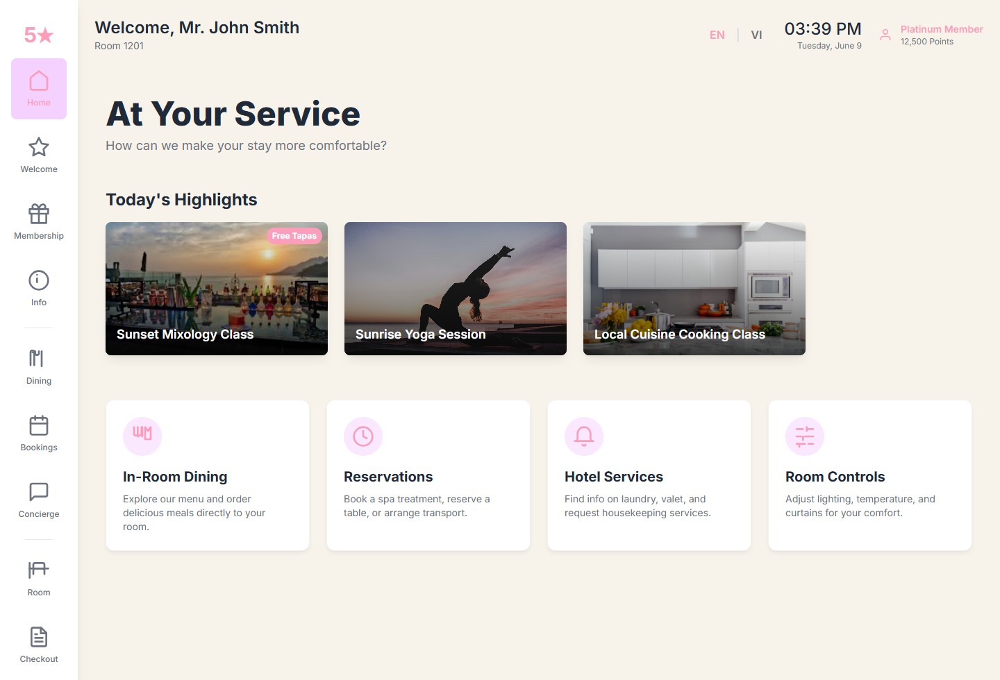
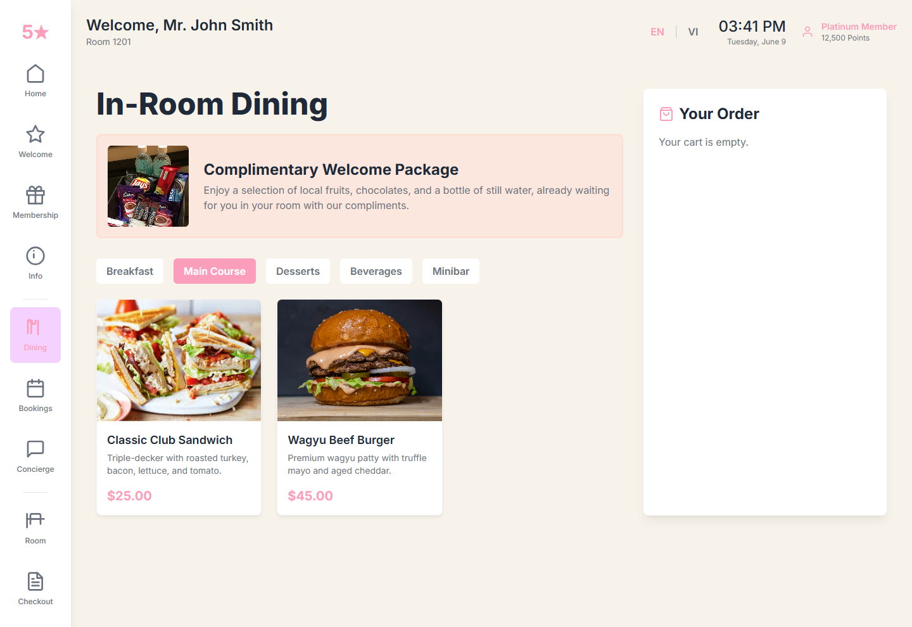
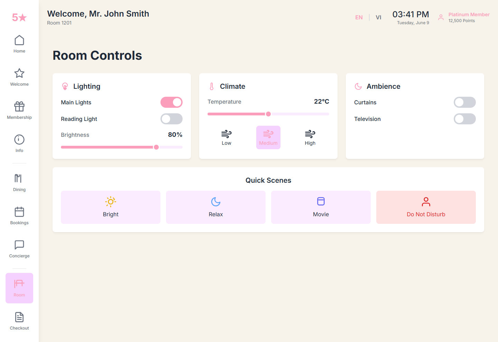

# Hospitality Smart Tablet

  

  <strong>An in-room digital experience that makes service feel faster, more premium, and easier to monetize.</strong>

  Smart Tablet gives guests a polished, hotel-grade interface for dining, bookings, concierge access,
  loyalty context, and ambient room controls without relying on repeated calls to the front desk.

  
  
  
  

  <strong>Read in English</strong> |
  <a href="README.vi.md"><strong>Đọc bằng tiếng Việt</strong></a>

  <a href="https://alphabotapphub.pages.dev/hospitalityapp_dashboard/"><strong>Live Site</strong></a>
  |
  <a href="https://alphabotapphub.pages.dev/hospitalitypackage/"><strong>View Ecosystem</strong></a>
  |
  <a href="SUPPORT.md"><strong>Support</strong></a>
  |
  <a href="docs/FAQ.md"><strong>FAQ</strong></a>

## What It Is

Hospitality Smart Tablet is the guest-facing layer of the Hospitality Suite ecosystem.

It is designed to:

- Welcome the guest,
- Expose key property information,
- Enable in-room dining and bookings,
- Provide concierge access,
- Offer smart-room controls.

## The Guest-Facing Difference

- Guests do not need to remember phone extensions or wait on routine calls
- Dining, services, and comfort controls live in one elegant interface
- The property gets a better chance to upsell relevant services at the right moment
- The experience feels closer to a branded digital concierge than a basic service menu

## Core Surfaces

- Home and welcome
- Membership context
- Information and hotel highlights
- Dining and ordering
- Bookings and concierge
- Room controls
- Checkout

## Why It Matters

The interface reduces friction for guests while also reducing routine service load for property staff.

It turns everyday in-room actions into:

- A more premium digital experience,
- Faster service access,
- Better opportunities for upsell and service discovery.

## What It Signals Commercially

- Better digital adoption for in-room services
- Higher visibility for F&B and premium service offers
- Stronger perceived sophistication for the property brand

## Visual Tour

  
  
  

## Product Boundaries

- This is the guest-facing app, not the central staff CMS
- Real device deployment may depend on tablet hardware and room integration setup
- Control depth for lights, climate, TV, or curtains depends on implementation details

## Availability

- Live surface: https://alphabotapphub.pages.dev/hospitalityapp_dashboard/

## Support

- Email: `taminhquan182@gmail.com`
- Zalo: `0908695494`

## Closed-Source Notice

This product is closed-source and this repository exists for public product-overview material only.
